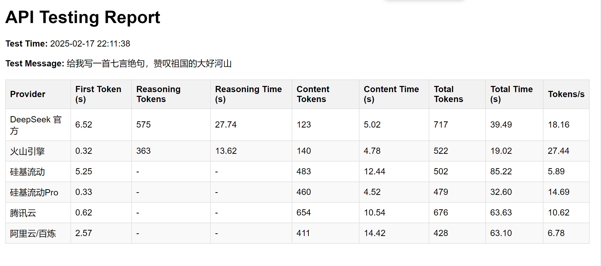

<div align="center">

# 🚀 DeepSeek API Ranking

[](https://www.python.org/) [](https://opensource.org/licenses/MIT) [](https://github.com/psf/black) []() []()

API服务性能评估和排名框架

</div>

## 项目概述

本项目提供了一个灵活的框架，用于对不同的API服务进行并行测试、性能评估和排名比较。主要功能包括自动化测试执行、性能数据收集和测试报告生成。

## 主要特性

- 并行测试执行能力
- 多API提供商支持
- 自动化测试报告生成
- 灵活的测试用例管理
- 性能指标收集和分析

## 项目结构

```
deepseek-api-ranking/
├── basetest.py          # 测试基础类定义
├── tester.py           # 核心测试实现
├── parallel_tester.py  # 并行测试实现
├── providers.py        # API提供商配置和管理
├── reporter.py         # 测试报告生成器
└── test_reports/       # 测试报告输出目录
```

## 主要组件说明

- `basetest.py`: 定义测试基础类和通用测试方法
- `tester.py`: 实现核心测试逻辑和测试用例执行
- `parallel_tester.py`: 提供并行测试能力，提高测试效率
- `providers.py`: 管理不同API提供商的配置和接口
- `reporter.py`: 负责生成测试报告和性能分析结果

## 使用方法

1. **配置API提供商**
   - 创建`.env`文件，并在其中配置API信息


2. **执行测试**
   python basetest.py

3. **查看测试报告**
   - 测试报告将自动生成在`test_reports`目录下
   - 报告包含详细的性能指标和比较结果

## 测试示例


## 配置要求

- Python 3.10+
- 相关依赖包（requirements.txt）
- API密钥和访问凭证

## 注意事项

1. 使用前请确保正确配置API密钥和访问凭证
2. 建议在测试执行前检查网络连接状态
3. 大规模并行测试时注意API访问限制

## 测试报告说明

测试报告包含以下主要信息：
- 测试执行时间和持续时间
- 各API提供商的性能指标
- 响应时间统计
- 错误率统计
- 性能排名比较

## 贡献指南

欢迎提交Issue和Pull Request来改进项目。在提交代码前，请确保：
1. 代码符合项目的编码规范
2. 添加了必要的测试用例
3. 更新了相关文档

## 许可证

MIT 许可证，详细信息请参见 [LICENSE](LICENSE) 文件。
